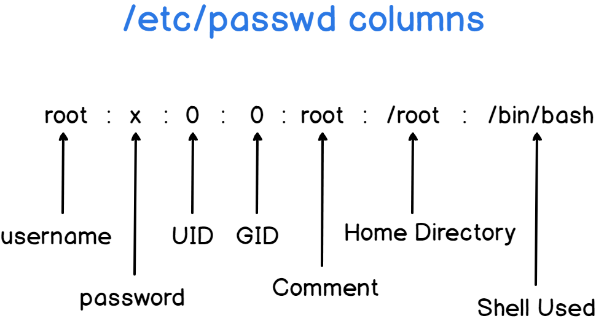

# Users and Groups Administration 
Super user account is the root which had unrestricted access and control  

/etc/passwd : contains information about user account. User account contains UID unique identifier for each user.  

/etc/shadow users password are store here  

 

 